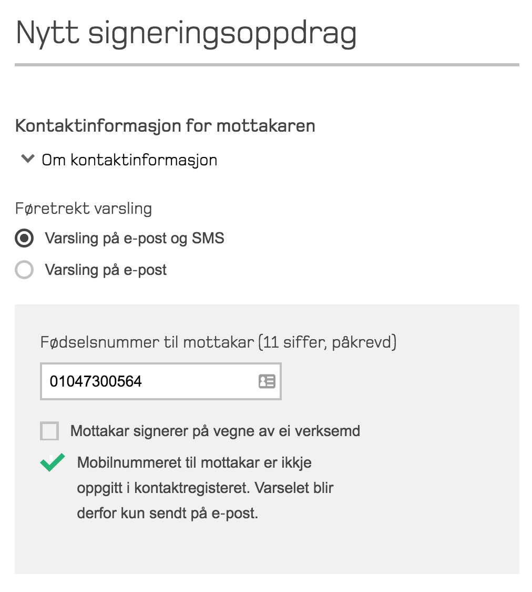

## 2016-08-16 – Multisignatar for synkrone oppdrag

**Denne versjonen bryter bakoverkompabilitet ved opprettelse av synkrone oppdrag via API.** Se [teknisk](#teknisk) for mer informasjon.

### Funksjonelt

* **Multisignatar for synkrone oppdrag.** Ved opprettelse av _synkrone oppdrag_ er det nå mulig å spesifisere opp til 10 signatarer (samme grense som for _asynkrone oppdrag_). Tjenesten vil returnere én `redirect-url` pr. signatar ved opprettelse som avsender skal videresende brukeren(e) til. Ved henting av status vil responsen fra tjenesten inneholde én aggregert status for hele signeringsoppdraget. I tillegg kommer én status og 0 eller én URL for å hente XAdES for hver signatar (avhengig om signataren har signert eller ikke).

### Teknisk

* **Bryter bakoverkompabilitet: endret respons ved polling av status på signeringsoppdrag.** `status` i `signature` er endret fra en XML-enum til `string`. `status` kan i fremtiden få nye verdier som vil være ukjent for eksisterende klienter. Klienter som bruker forrige versjon av APIet vil oppleve feil når de mottar responser med nye enum-typer. Ved ukjent signatarstatus skal klienten forholde seg til overordnet signaturstatus, som beskrevet under. _Denne endringen påvirker bare integrasjoner som oppretter redirectoppdrag._

## 2016-06-22 – Polling på synkrone oppdrag

###  Funksjonelt

* **Polling på synkrone oppdrag.**
  Det synkrone API et mot signeringstjenesten er endret med en alternativ måte å hente ned det signerte dokumentet for avsenderen. Utvidelsen gir mulighet til å gjøre generell polling ved å spørre om status på alle synkrone oppdrag for en gitt avsender. På samme måte som i det asynkrone APIet vil klienten tolke alle statuser som returneres (alle åpne synkrone oppdrag) og markere hvilke statuser som er ferdigprosessert før referansen i statusresponsen brukes til å hente det signerte dokumentet.

## 2016-05-31 – Varsling og arkiv

</img>

**Denne versjonen bryter bakoverkompabilitet ved opprettelse av portaloppdrag via API.** Se [teknisk](#teknisk) for mer informasjon. Det er per dags dato ingen integrasjoner som benytter berørt funksjonalitet i produksjon. Vi anbefaler at alle som bruker klientbiblioteker oppgraderer til siste versjon så snart som mulig.

### Funksjonelt

* **Langtidsarkivering av signeringsoppdrag.**
  Ved arkivering vil oppdrag oppbevares i virksomhetens akriv i Signeringstjenesten i 50 år. Arkivering skrus på for hver enkelt virksomhet, og vil ikke påvirke eksistserende virksomheter.
* **Varsling av signatarer.** 
  Oppslagstjenesten slår opp kontaktinformasjon for borgere i Difis Kontakt- og reservasjonsregister for oppdrag som skal signeres i portalen. Dette gjøres for alle nyopprettede portaloppdrag, og vil derfor endre oppførselen for eksisterende virksomheter. Se [den funksjonelle dokumentasjonen](funksjonell-spesifikasjon.md#varsling) for mer informasjon om varsling. Endringen er ikke relevant for synkrone signeringsoppdrag.
* **Ikke-sensitiv tittel for oppdrag.**
  Virksomheter kan spesifisere en ikke-sensitiv tittel for signeringsoppdraget. Denne tittelen kan brukes i kontekster der brukeren ikke er sterkt autentisert, som for eksempel i varsler eller kommunikasjon til saksbehandlere hos virksomheten.

### Teknisk

* **Bryter bakoverkompabilitet: endret respons ved polling av status på signeringsoppdrag**.
  `status` i `signature` er endret fra en XML-enum til `string`. `status` kan i fremtiden få nye verdier som vil være ukjent for eksisterende klienter. Klienter som bruker forrige versjon av APIet vil oppleve feil når de mottar responser med nye enum-typer. Ved ukjent signatarstatus skal klienten forholde seg til overordnet signaturstatus, som beskrevet under. *Denne endringen påvirker bare integrasjoner som oppretter portaloppdrag.*
* **Enklere status på oppdrag:** Overordnet status på et signeringsoppdrag kan hentes ut i `status`-feltet på `portal-signature-job-status-change-response`. Mulig status er `IN_PROGRESS`, `COMPLETED_SUCCESSFULLY` eller `FAILED`. `FAILED` er en ny enum-status som ikke eksisterte i forrige versjon av APIet.
